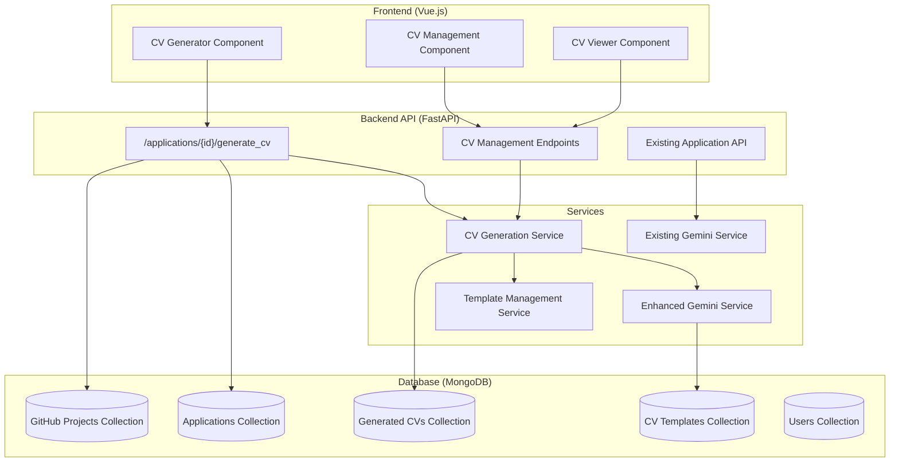
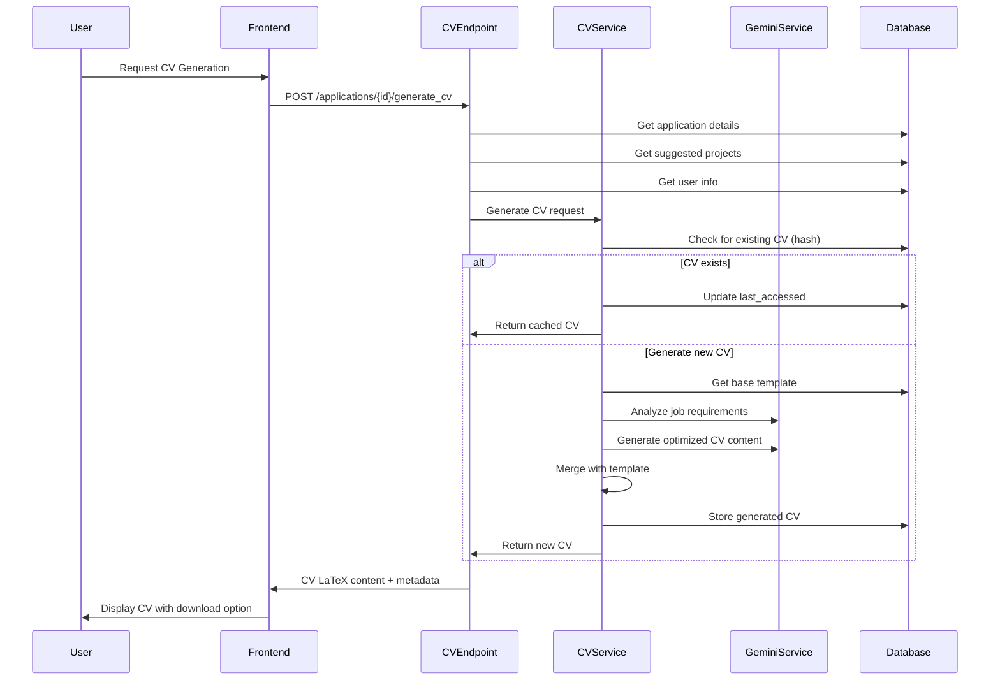
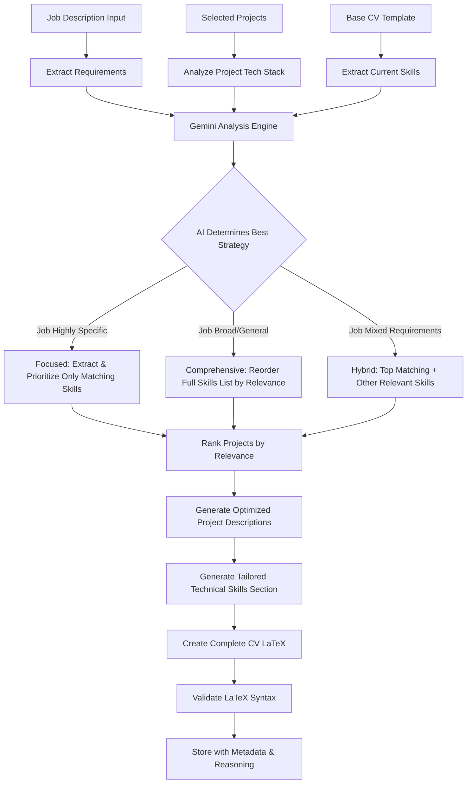

# Automated CV Generation System - Architecture Plan

## Overview

This document outlines the architecture for an automated CV generation system that integrates with the existing job tracker application. The system uses AI to create tailored CVs based on job requirements, optimizing project selection and technical skills presentation.

## Goals

- Generate completely new CVs tailored to specific job requirements
- Use AI to optimize project selection and skill prioritization based on job descriptions
- Store templates and generated CVs to avoid redundant generation
- Integrate seamlessly with existing job tracker application
- Output CVs in LaTeX format for use with Overleaf

## System Architecture Overview



## Database Schema Design

### CV Templates Collection
```javascript
{
  "_id": ObjectId,
  "user_id": ObjectId,
  "name": String,                    // "Default Template", "Modern Template"
  "description": String,             // Template description
  "latex_template": String,          // Complete LaTeX template
  "sections_config": {               // Configuration for dynamic sections
    "projects_section": {
      "max_projects": Number,        // Maximum projects to include
      "sort_by": String,            // "relevance", "recent", "stars"
      "include_github_links": Boolean
    },
    "skills_section": {
      "strategy": String,           // "focused", "comprehensive", "hybrid"
      "max_skills_per_category": Number,
      "categories": [String]        // ["Programming Languages", "AI/ML", etc.]
    }
  },
  "is_default": Boolean,
  "created_at": DateTime,
  "updated_at": DateTime
}
```

### Generated CVs Collection
```javascript
{
  "_id": ObjectId,
  "user_id": ObjectId,
  "application_id": ObjectId,
  "template_id": ObjectId,
  "selected_project_ids": [ObjectId],
  "job_title": String,
  "company_name": String,
  "generated_latex": String,         // Complete LaTeX CV
  "metadata": {
    "generation_strategy": String,   // AI strategy used
    "skills_included": [String],     // Skills that were included
    "projects_ranked": [{            // Projects with relevance scores
      "project_id": ObjectId,
      "relevance_score": Number,
      "included": Boolean
    }],
    "generation_time_ms": Number,
    "ai_reasoning": String          // AI's reasoning for choices
  },
  "hash_signature": String,         // Hash of inputs for deduplication
  "created_at": DateTime,
  "last_accessed": DateTime
}
```

## CV Generation Workflow



## AI-Powered Content Generation Strategy



## API Endpoints

### CV Generation
```
POST /applications/{application_id}/generate_cv
```

**Request Body:**
```javascript
{
  "project_ids": [String],          // Optional: override suggested projects
  "template_id": String,            // Optional: use specific template
  "force_regenerate": Boolean       // Optional: bypass cache
}
```

**Response:**
```javascript
{
  "cv_id": String,
  "latex_content": String,
  "metadata": {
    "generation_strategy": String,
    "projects_included": Number,
    "skills_categories": [String],
    "ai_reasoning": String,
    "cached": Boolean
  },
  "download_url": String
}
```

### CV Management
```
GET    /cvs/                       // List user's CVs
GET    /cvs/{cv_id}               // Get specific CV
DELETE /cvs/{cv_id}               // Delete CV
GET    /cv-templates/             // List available templates
POST   /cv-templates/             // Create custom template
```

## Implementation Phases

### Phase 1: Core Backend Infrastructure
**Files to Create:**
- `app/models/cv_template.py` - CV template data model
- `app/models/generated_cv.py` - Generated CV data model
- `app/services/cv_generation_service.py` - Core CV generation logic
- `app/services/template_service.py` - Template management
- `app/api/cv.py` - CV-related API endpoints

**Extend:**
- `app/services/gemini_service.py` - Add CV generation methods

### Phase 2: Database Setup and Initial Templates
- Create MongoDB collections
- Seed default CV template from existing cv.tex
- Implement caching and deduplication logic

### Phase 3: AI Content Generation
- Develop Gemini prompts for CV optimization
- Implement skill extraction and prioritization
- Create project ranking and description optimization
- Add reasoning and metadata tracking

### Phase 4: Frontend Integration
**Files to Create:**
- `job-tracker-frontend/src/components/CVGenerator.vue`
- `job-tracker-frontend/src/components/CVViewer.vue`
- `job-tracker-frontend/src/components/CVList.vue`
- `job-tracker-frontend/src/views/CVManagementView.vue`

**Extend:**
- Add CV generation to application detail views
- Integrate with email generator workflow

### Phase 5: Advanced Features
- PDF generation via LaTeX compilation
- Template customization interface
- CV comparison and analytics
- Export and sharing capabilities

## Technical Implementation Details

### CV Generation Logic (Pseudocode)

```python
async def generate_cv(application_id: str, project_ids: List[str] = None, user: User):
    # 1. Generate content hash for caching
    content_hash = hash_cv_inputs(application_id, project_ids or [], user.id)
    
    # 2. Check for existing CV
    existing_cv = await check_existing_cv(content_hash)
    if existing_cv and not force_regenerate:
        await update_last_accessed(existing_cv.id)
        return existing_cv
    
    # 3. Gather input data
    application = await get_application(application_id)
    if not project_ids:
        # Use AI-suggested projects
        project_ids = await suggest_projects(application_id)
    
    projects = await get_projects(project_ids)
    base_template = await get_default_template(user.id)
    
    # 4. AI-powered content generation
    optimized_content = await gemini_service.generate_cv_content(
        job_description=application.job_description,
        projects=projects,
        current_skills=extract_skills_from_template(base_template),
        user_info=user
    )
    
    # 5. Generate LaTeX CV
    latex_cv = await merge_content_with_template(base_template, optimized_content)
    
    # 6. Validate LaTeX syntax
    validation_result = validate_latex_syntax(latex_cv)
    if not validation_result.valid:
        raise CVGenerationError(f"Invalid LaTeX: {validation_result.errors}")
    
    # 7. Store and return
    generated_cv = await store_generated_cv(
        latex_cv, content_hash, optimized_content.metadata, application_id
    )
    return generated_cv
```

### Gemini Prompt Strategy

```python
def create_cv_generation_prompt(job_description: str, projects: List[Dict], 
                               current_skills: Dict, user_info: Dict) -> str:
    return f"""
You are an expert CV optimization specialist and LaTeX expert. Your task is to generate a complete, 
tailored CV in LaTeX format that maximizes relevance to the job requirements.

## Job Requirements Analysis:
{job_description}

## Available Projects (with technical details):
{format_projects_for_analysis(projects)}

## Current Skills Inventory:
{format_skills_inventory(current_skills)}

## User Information:
- Name: {user_info['name']}
- Email: {user_info['email']}
- Current Experience Level: {infer_experience_level(projects)}

## Task Instructions:
1. **Analyze Job Requirements**: Extract key technical skills, experience requirements, and domain focus
2. **Determine Strategy**: Choose the best approach for skills presentation:
   - FOCUSED: For specialized roles requiring specific tech stack
   - COMPREHENSIVE: For broad roles or senior positions
   - HYBRID: For roles with both specific and general requirements
3. **Rank Projects**: Score each project (0-100) based on relevance to job requirements
4. **Optimize Project Descriptions**: Rewrite project descriptions to highlight job-relevant achievements
5. **Generate Skills Section**: Create technical skills section using chosen strategy
6. **Create Complete CV**: Output full LaTeX document following the template structure

## Output Format:
Return a JSON object with:
{{
  "strategy_chosen": "focused|comprehensive|hybrid",
  "reasoning": "Explanation of why this strategy was chosen",
  "projects_analysis": [
    {{
      "project_name": "project name",
      "relevance_score": 85,
      "key_technologies": ["Python", "FastAPI"],
      "optimized_description": "Rewritten description emphasizing job relevance"
    }}
  ],
  "skills_analysis": {{
    "strategy": "detailed strategy explanation",
    "prioritized_skills": {{
      "Programming Languages": ["Python (Expert)", "JavaScript (Proficient)"],
      "AI/ML & Analytics": ["PyTorch", "Scikit-learn", "Computer Vision"],
      // ... other categories
    }}
  }},
  "complete_latex_cv": "COMPLETE LaTeX document here"
}}

## Important Notes:
- Include ONLY the top 3-5 most relevant projects
- Ensure LaTeX syntax is valid and compilable
- Maintain professional formatting and structure
- Use specific metrics and achievements where possible
- Keep technical skills organized by logical categories
- Ensure the CV flows naturally and tells a cohesive story
"""
```

### Caching and Deduplication Strategy

```python
def generate_cv_hash(application_id: str, project_ids: List[str], user_id: str) -> str:
    """Generate a hash for CV input combination to enable caching"""
    # Sort project IDs for consistent hashing
    sorted_projects = sorted(project_ids)
    
    # Include relevant application data (not full description to allow minor changes)
    app_key = f"{application_id}:{get_job_requirements_hash(application_id)}"
    projects_key = ":".join(sorted_projects)
    
    content = f"{user_id}:{app_key}:{projects_key}"
    return hashlib.sha256(content.encode()).hexdigest()

async def check_existing_cv(content_hash: str) -> Optional[GeneratedCV]:
    """Check if CV with same inputs already exists"""
    cv = await db.generated_cvs.find_one({"hash_signature": content_hash})
    if cv and (datetime.utcnow() - cv["created_at"]).days < 30:  # 30-day cache
        return cv
    return None
```

## Future Enhancements

1. **PDF Generation**: Integrate LaTeX compiler for direct PDF output
2. **Template Editor**: Visual editor for creating custom CV templates
3. **A/B Testing**: Track CV performance and optimize generation strategies
4. **Industry Templates**: Specialized templates for different industries
5. **Multi-language Support**: Generate CVs in different languages
6. **Version Control**: Track CV versions and changes over time
7. **Integration with ATS**: Optimize CVs for Applicant Tracking Systems

## Security Considerations

- Validate all LaTeX input to prevent code injection
- Rate limit CV generation to prevent abuse
- Secure storage of personal information
- User consent for AI processing of personal data
- Data retention policies for generated CVs

## Performance Optimization

- Cache frequently used templates and skills data
- Implement background CV generation for large batches
- Use CDN for CV file delivery
- Monitor and optimize Gemini API usage
- Implement fallback strategies for AI service failures

---

**Next Steps**: Begin implementation with Phase 1 (Core Backend Infrastructure)